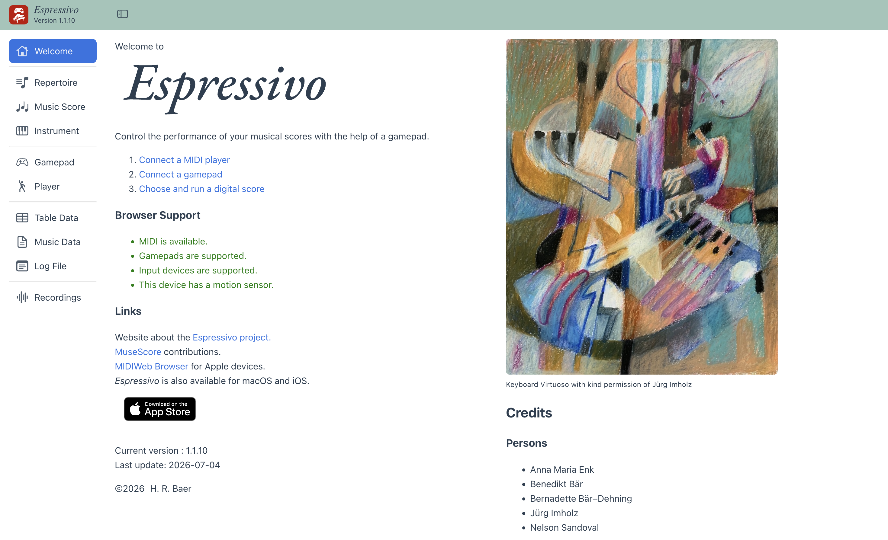

# Espressivo

*A musical Web app project.*

## What is Espressivo?

*Espressivo* is a Web app that enables you to play music scores *with expression*:
With the help of a *gamepad*.

The gamepad is used to control the following musical elements:

- Tempo
- Velocity or volume
- Articulation

Where appropriate, musical control can further be restricted to staves and/or voices.

The app is built with Vue.js 3.

## Espressivo in Action

Try out [Espressivo](https://music.ursamedia.ch/apps/espressivo/) from this link.

## Requirements

To run *Espressivo* you need the following devices and software:

- A gamepad
- A MIDI player
- A Web browser supporting the Web MIDI API

Note: The *Safari* Web browser does not support the Web MIDI API.

## Digital Scores

*Espressivo* already includes a small collection of digital scores.
For additional scores you may find music pieces of your choice at the [MuseScore](https://musescore.com/) Web site.

## Setup

Use *npm* to set-up the *Espressivo* project:

- `npm install` to install the project

- `npm run dev` to run a development server

- `npm run build` to build the Web app

- `npm run preview` to serve the built project

## Gamepads

Most gamepads supported by Web MIDI should just work.
For best results consider using a gamepad with a built-in motion sensor.

Currently, the following devices are supported (via WebHID):

- Playstation 4 Gamepad
- Playstation 5 Gamepad
- 8BitDo Pro 2 Bluetooth Gamepad (mode D)
- Nintendo Switch Gamepad

Note that the Nintendo Switch lacks an analog trigger.

Unfortunately, the Xbox controller has no motion sensor.

## Mapping the Gamepad's Keys

How are the gamepad's buttons, sticks and sensors mapped to control the music performance?
The answer depends on the type of gamepad you are using and the music score (the number of staves and voices).

### Motion Sensor

When a motion sensor is available:

- A rotation around the X axis is used to control the tempo
- A rotation around the Y axis affects the velocity or volume

### Analog Sticks

The analog sticks are mostly used to change the velocity or volume.
When there are two or more staves,
the sticks on the left will control the lower,
those on the right the upper staves.
In the case of a missing motion sensor,
the analog sticks will also control the tempo.
The X and Y direction of the sticks are assigned to different voices.

### Triggers

Trigger buttons are typically used to set the articulation and press the pedals.
When there are two or more staves,
the trigger buttons on the left will control the lower,
those on the right the upper staves.

### Buttons

The four buttons on the right side of the gamepad control the playback:

- Start and stop the player
- Move to the beginning of the music piece
- Go to the next music piece in the playlist
- Change to the previous music piece in the playlist

### Direction Pad

These buttons can be used for app navigation.

## Credits

Just to mention the most prominent library used in this project:

[Verovio](https://www.verovio.org/index.xhtml): A music notation engraving library.

## Further Information

Visit the Web site about the [Espressivo project](https://www.ursamedia.ch/).
